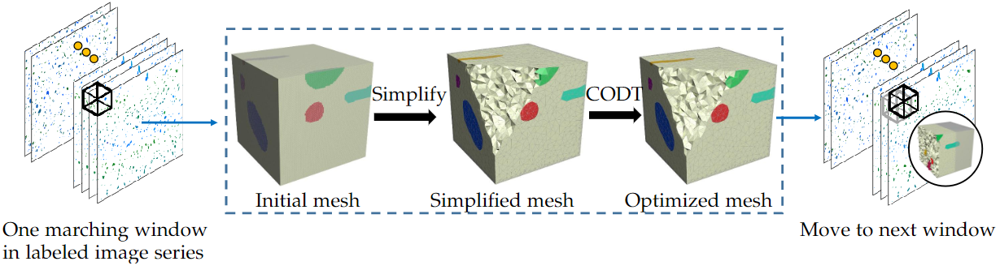
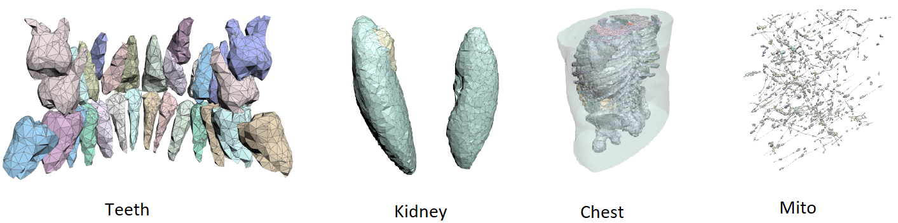

# Marching Windows: Scalable Mesh Generation for Volumetric Data with Multiple Materials

This repository contains code for the paper:
Marching Windows: Scalable Mesh Generation for Volumetric Data with Multiple Materials

inal volumetric data. In this paper we propose a novel approach, called Marching Windows, that uses a moving window and a disk-swap strategy to reduce the run-time memory footprint, devise a new scheme that guarantees to preserve the topological structure of the original dataset, and adopt an error-guided optimization technique to improve both geometric approximation error.




## Set Up Environment
Below are the main packages we used in thie project:

- `boost 1.56.0`
- `CGAL`
- `hdf5 1.10.1`
- `opencv 2.4.9`
- `SparseSky`
- `tetgen`
- `zlib`

## Repository Structure

Below are the main directories in the repository: 

- `console/`: the code call the main functions of simlification;
- `simplification3d/`: the main code for the simplification functions.
- `data/`: the code to prepare the datasets from labeled data

# Running the Code

##  Dataset preparation
- Download the image files
- Run png2svdata python scripts to process the data

## Usage and Options

Compile the code (with preferably VS2012), run the compiled project with command as:

.\simplification3d [data_folder] [target_simplifying ratio_usually_0.01] [odt_count] [target_edge_variance] [dim_x] [dim_y] [dim_z]

## Results

<p float="left">
  
</p>

Results of different datasets.


## Citation

If any part of this code is used, please give appropriate citation to our paper. <br />

```
Zhang W, Yue Y, Pan H, Chen Z, Wang C, Pfister H, Wang W. Marching Windows: Scalable Mesh Generation for Volumetric Data with Multiple Materials. IEEE Trans Vis Comput Graph. 2022 Dec 1;PP. doi: 10.1109/TVCG.2022.3225526. Epub ahead of print. PMID: 36455093.
```

## Authors

* [Wenhua Zhang](https://github.com/WinnieLaugh)

## License

The dataset provided here is for research purposes only. Commercial use is not allowed. The data is held under the following license:
[Attribution-NonCommercial-ShareAlike 4.0 International](https://creativecommons.org/licenses/by-nc-sa/4.0/)


